<!-- Level 2: Bio and Detailled Features -->

                

                I believe in action over theory.

<table width="100%" style="width: 100%; table-layout: fixed; border-collapse: collapse; border: none;">
  <tr>
    <td align="center" valign="middle" style="width: 50%; border: none; padding: 0;">
      
    </td>
    <td align="center" valign="middle" style="width: 50%; border: none; padding: 0;">
      
    </td>
  </tr>
</table>

##
🧑🏽‍🎓 Computer Science Student  
🧑🏽‍💻 Fullstack Developer sharing his Journey through Tech  
💻 Next.js and Python fan  
📌 Currently working at :  
  OpenSource Together as Founder Front dev (the best team ever)  

📈 Goals for 2026 :  
  Scale OST to the top  
  Build a strong dev brand on X  

💡 I believe in action over theory, and I'm all about learning, building, and sharing my projects

## 🌐 My Socials :
 

<!--
## 💻 Stack :

## 📊 GitHub Streak and Stats :

 

<!-- Proudly created with GPRM ( https://gprm.itsvg.in ) -->
